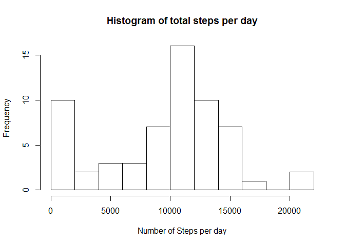
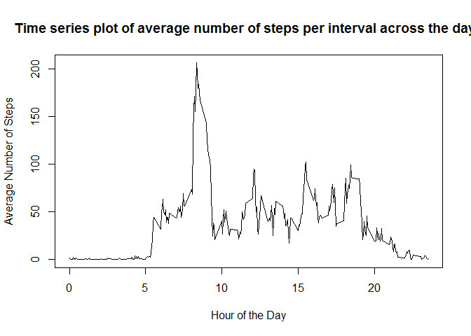
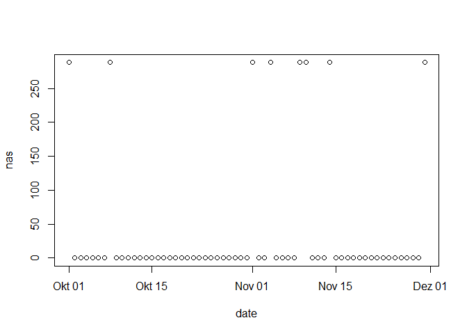
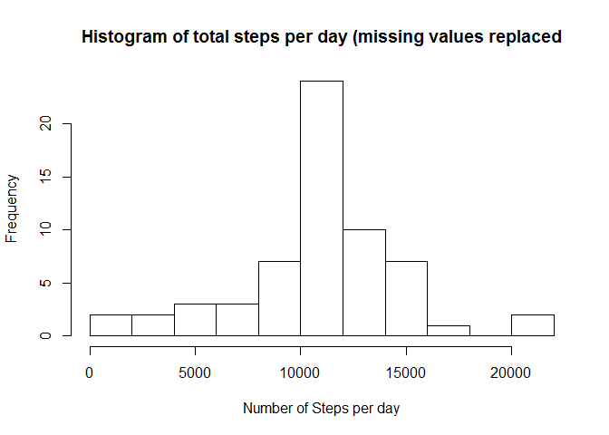
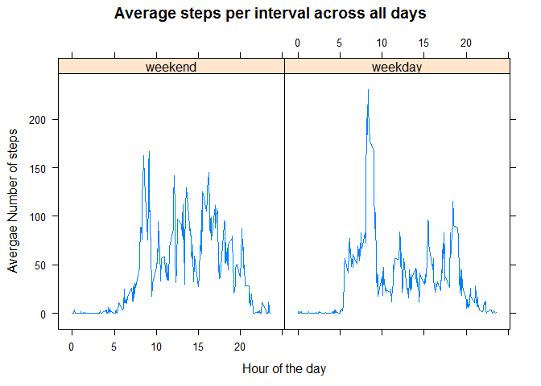

# Reproducible Research: Peer Assessment 1
<!-- 
current_wd <- getwd()
setwd(file.path(current_wd, "Reproducible_Research", "week2_assignment", "RepData_PeerAssessment1"))
-->

## Loading and preprocessing the data
Before analysing, we need to load the data into an R dataframe. It is assumed that the data lies in a zip file within the same directory as this .Rmd file. After reading in the data, the date column is converted to the datatype date to make it easier to deal with that column later on.


```r
activity_data <- read.table(unz("activity.zip", "activity.csv"), header=TRUE, sep = ",", na.string="NA")
activity_data$date <- as.Date(activity_data$date, format = "%Y-%m-%d")
```
Let's have some closer look at the data.

```r
str(activity_data)
```

```
## 'data.frame':	17568 obs. of  3 variables:
##  $ steps   : int  NA NA NA NA NA NA NA NA NA NA ...
##  $ date    : Date, format: "2012-10-01" "2012-10-01" ...
##  $ interval: int  0 5 10 15 20 25 30 35 40 45 ...
```

```r
summary(activity_data)
```

```
##      steps             date               interval     
##  Min.   :  0.00   Min.   :2012-10-01   Min.   :   0.0  
##  1st Qu.:  0.00   1st Qu.:2012-10-16   1st Qu.: 588.8  
##  Median :  0.00   Median :2012-10-31   Median :1177.5  
##  Mean   : 37.38   Mean   :2012-10-31   Mean   :1177.5  
##  3rd Qu.: 12.00   3rd Qu.:2012-11-15   3rd Qu.:1766.2  
##  Max.   :806.00   Max.   :2012-11-30   Max.   :2355.0  
##  NA's   :2304
```

```r
head(activity_data)
```

```
##   steps       date interval
## 1    NA 2012-10-01        0
## 2    NA 2012-10-01        5
## 3    NA 2012-10-01       10
## 4    NA 2012-10-01       15
## 5    NA 2012-10-01       20
## 6    NA 2012-10-01       25
```

```r
tail(activity_data)
```

```
##       steps       date interval
## 17563    NA 2012-11-30     2330
## 17564    NA 2012-11-30     2335
## 17565    NA 2012-11-30     2340
## 17566    NA 2012-11-30     2345
## 17567    NA 2012-11-30     2350
## 17568    NA 2012-11-30     2355
```
So, this data set contains 17568 entries with 2304 missing values in the activity column. The data was measured in the months October and November in 2012 every 5 minutes, with each day having 288 entries.

## What is mean total number of steps taken per day?
To find out the mean of the total number of steps taken per day, first the steps taken per day need to be summed up. Let's use the dplyr-Packge to construct a new dataframe by grouping the data by date and then applying the sum() function to the groups ignoring the missing values:

```r
library(dplyr)
grouped_activity_data <- group_by(activity_data, date)
steps_per_day <- summarize(grouped_activity_data, sum_steps = sum(steps, na.rm=TRUE))
```
Here's the histogram broken up into 11 bins:

```r
hist(steps_per_day$sum_steps, breaks = 11, main = "Histogram of total steps per day", xlab = "Number of Steps per day")
```

<!-- -->

We can clearly see that the participant walked each day between 0 and 22000 steps. The histogram also shows that the range between 10000 to 12000 steps is the one with the highest frequency of 16 days. The distribution of the frequency looks similar to a normal distribution with one major exception: There have been unusually many days (10 days) where the participiant walked less than 2000 steps. That will surely influence the mean of the the total number of steps per day. So, let's have a look at the mean now:

```r
mean(steps_per_day$sum_steps)
```

```
## [1] 9354.23
```
So the mean of the total number of steps is abaout 9354 per day.
The median however should be a higher value than the mean. 

```r
median(steps_per_day$sum_steps)
```

```
## [1] 10395
```
And as we can see, the median is way higher than the mean. It's actually about 1000 steps higher. Within a range between 0 and 22000 that is a significant difference which is due to the high amount of days where less than 2000 steps were taken by the participant.

## What is the average daily activity pattern?
For getting the average number of steps taken per interval across all the days, let's create another data frame with dplyr. Let's group the original dataframe by interval and then compute the average of each group.

```r
grouped_activity_data_per_interval <- group_by(activity_data, interval)
avg_steps_per_interval <- summarize(grouped_activity_data_per_interval, avg_steps = mean(steps, na.rm=TRUE))
```
For the plot, let's label the x axis with the hours of the day instead of the number format within the interval column.

```r
plot(avg_steps_per_interval$interval/100, avg_steps_per_interval$avg_steps, type = "l", main = "Time series plot of average number of steps per interval across the days", xlab = "Hour of the Day", ylab = "Average Number of Steps")
```

<!-- -->

In the plot we can see, that the participant is usually active between 5 am and roughly 20 pm with some minor activities after 20 pm until 22 pm. The most active time is in the morning around 8 am. Let's check which 5-minute interval, on average across all the days in the dataset, contains the maximum number of steps:

```r
avg_steps_per_interval[avg_steps_per_interval$avg_steps==max(avg_steps_per_interval$avg_steps),]
```

```
## # A tibble: 1 × 2
##   interval avg_steps
##      <int>     <dbl>
## 1      835  206.1698
```
So, the most active interval on average across all days is the one between 8:35 am and 8:40 am with an average amount of around 206 steps.

## Imputing missing values
Since there are a lot of missing values in the data set, the data is incomplete. However, we can impute the the msising values to get a better picture of the activities.
But first let's have a look how many missing values we actually have:

```r
sum(is.na(activity_data$steps))
```

```
## [1] 2304
```

```r
sum(is.na(activity_data$steps))/nrow(activity_data)
```

```
## [1] 0.1311475
```
So, there are 2304 missing values among the recorded steps which is about 13 % of the total recordings.
To find a good strategy, how to impute the missing values, let's check how many values are missing per day:

```r
number_na_per_day <- summarize(grouped_activity_data, nas = sum(is.na(steps)))
plot(number_na_per_day)
```

<!-- -->

That shows us that the missing values occur either a whole day through or not at all. In total, it's 8 days with missing values.
So, imputing the missing values by an average of the day won't work, since the whole day has missing values. Our first best strategy is to imute the missing values by using the average of the 5-minute interval that we computed earlier.

```r
activity_data_with_replaced_na <- activity_data
activity_data_with_replaced_na$steps[is.na(activity_data_with_replaced_na$steps)] <- avg_steps_per_interval$avg_steps
```
Now this only works, because whole days are missing in the original data set. Because avg_steps_per_interval has the same number of rows as exactly one day has in the original data set. If the missing values were spread all over the orginal data set, a more sophisticated approach would be needed ro replace tham. E.g. one could join the avg_steps_per_interval to the original data set on the interval column, then compute a new column with an ifelse-approach to fill it with original values and fill out the missing values with the averages.

Now let's have a look at the histogram of the total number of steps taken per day:

```r
grouped_activity_data_replaced_na <- group_by(activity_data_with_replaced_na, date)
steps_per_day_replaced_na <- summarize(grouped_activity_data_replaced_na, sum_steps = sum(steps, na.rm=TRUE))
hist(steps_per_day_replaced_na$sum_steps, breaks = 11, main = "Histogram of total steps per day (missing values replaced", xlab = "Number of Steps per day")
```

<!-- -->

Compared to the first histogram, there are far less days with less than 2000 steps per day. And there are far more days with between 10000 and 12000 steps. so the eight days that have been filled up with the average values for the interval have been moved from the bin with the lowest number of steps to the bin with the average number of steps which is indeed what we wanted to achive with our filling strategy.

Let's compute the mean and the median again:

```r
mean(steps_per_day_replaced_na$sum_steps)
```

```
## [1] 10766.19
```

```r
median(steps_per_day_replaced_na$sum_steps)
```

```
## [1] 10766.19
```
The mean and the median are actually the same now. Compared to the mean and median of the original data set, the median did slightly change and the new mean is significantly higher.

So, the impact of imputing missing values on the estimates of the total daily number of steps significantly changes the averages. It kind of smoothes the data.

## Are there differences in activity patterns between weekdays and weekends?
First, let's create a new column called weekday as a factor variable with two levels "weekend" and "weekday":

```r
my_weekend <- c("Samstag", "Sonntag", "Saturday", "Sunday")
activity_data_with_replaced_na$weekday <- factor((weekdays(activity_data_with_replaced_na$date) %in% my_weekend), levels = c(TRUE, FALSE), labels=c("weekend", "weekday"))
```
Now, let's have a look at the differences in activity patterns by plotting the patterns for weekend and weekday:

```r
steps_per_interval_weekday <- activity_data_with_replaced_na %>% group_by(weekday, interval) %>% summarise(avg_steps = mean(steps))
library(lattice)
xyplot(avg_steps~(interval/100)|weekday, data=steps_per_interval_weekday, type='l', main="Average steps per interval across all days", xlab="Hour of the day", ylab="Avergae Number of steps")
```

<!-- -->

As we can see, the activity patterns for weekend and weekday are slightly different. On a weekday there is an activity peak around 8 am, the rest of the day the person is less active. On a weekend the particpant's activity is more distrbuted during the day.

